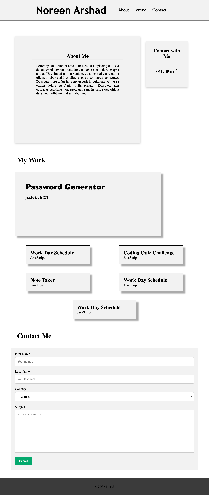

# Professional-Portfolio
Advanced CSS work profile

## Authors

- [NoreenA](https://github.com/noori36)


## User Story

```
AS AN employer
I WANT to view a potential employee's deployed portfolio of work samples
SO THAT I can review samples of their work and assess whether they're a good candidate for an open position
```
## App Behaviour 

```
GIVEN I need to sample a potential employee's previous work
WHEN I load their portfolio
THEN I am presented with the developer's name, a recent photo or avatar, and links to sections about them, their work, and how to contact them
WHEN I click one of the links in the navigation
THEN the UI scrolls to the corresponding section
WHEN I click on the link to the section about their work
THEN the UI scrolls to a section with titled images of the developer's applications
WHEN I am presented with the developer's first application
THEN that application's image should be larger in size than the others
WHEN I click on the images of the applications
THEN I am taken to that deployed application
WHEN I resize the page or view the site on various screens and devices
THEN I am presented with a responsive layout that adapts to my viewport
```


## Links

[The URL of the deployed application.](https://noori36.github.io/PasswordGenerator/)

[The URL of the GitHub repository.](https://github.com/noori36/Professional-Portfolio)


## Screenshot
Once deployed the application can be viewed in a traditional desktop web browser. <br />
<br>


## License

[MIT](https://choosealicense.com/licenses/mit/)
